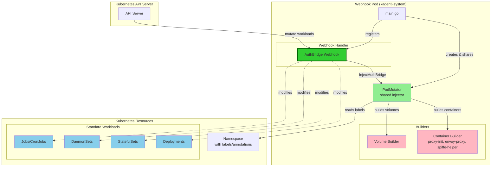
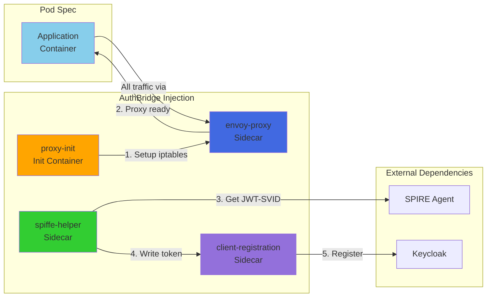
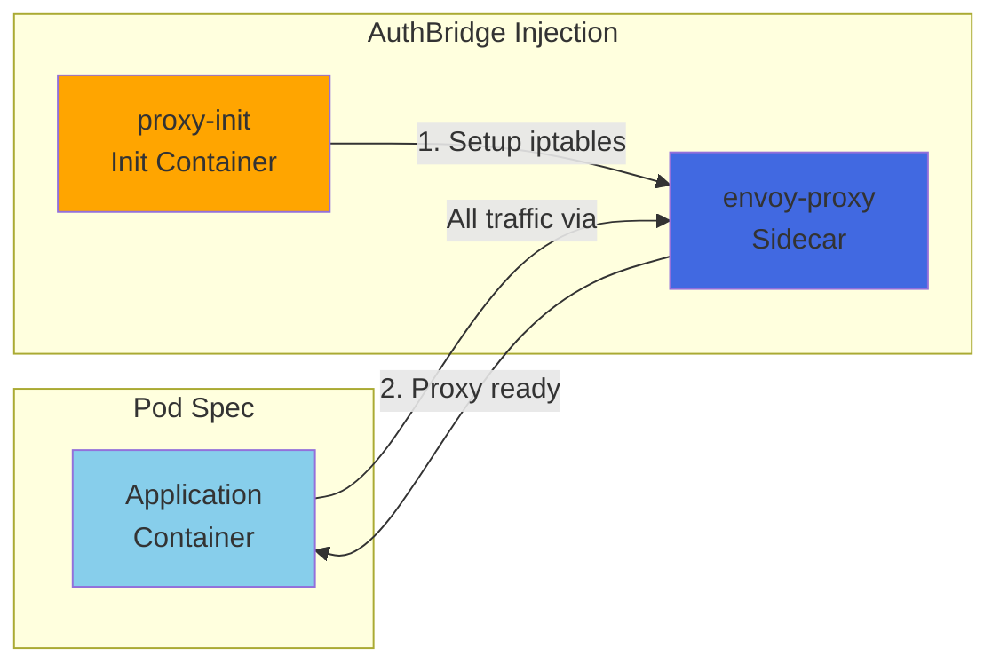
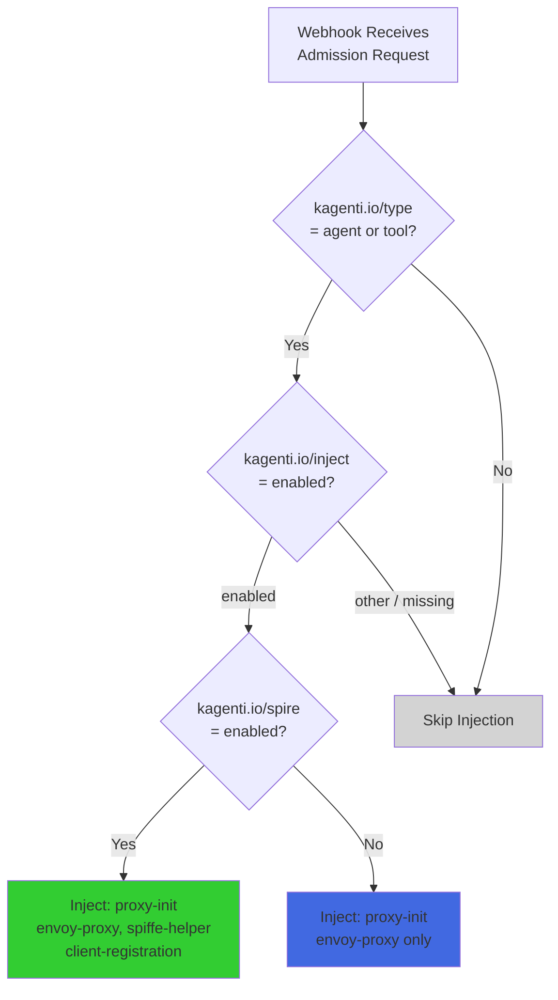

# Kagenti Webhook Architecture

This document provides Mermaid diagrams illustrating the webhook architecture.

## Component Architecture

## Container Injection Flow

### With SPIRE Integration

When `kagenti.io/spire: enabled` label is set on the pod template:

### Without SPIRE Integration

When `kagenti.io/spire` label is **not** set (default):

## Injection Decision Flow

